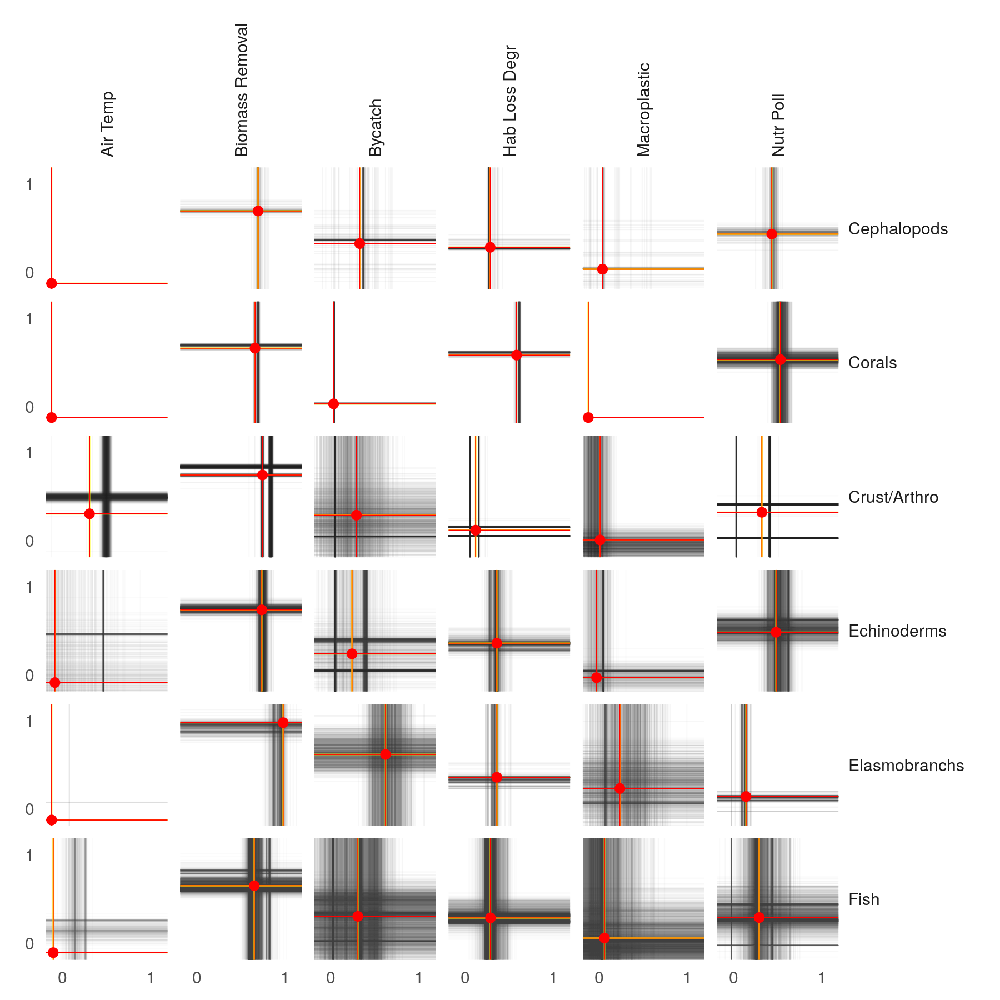
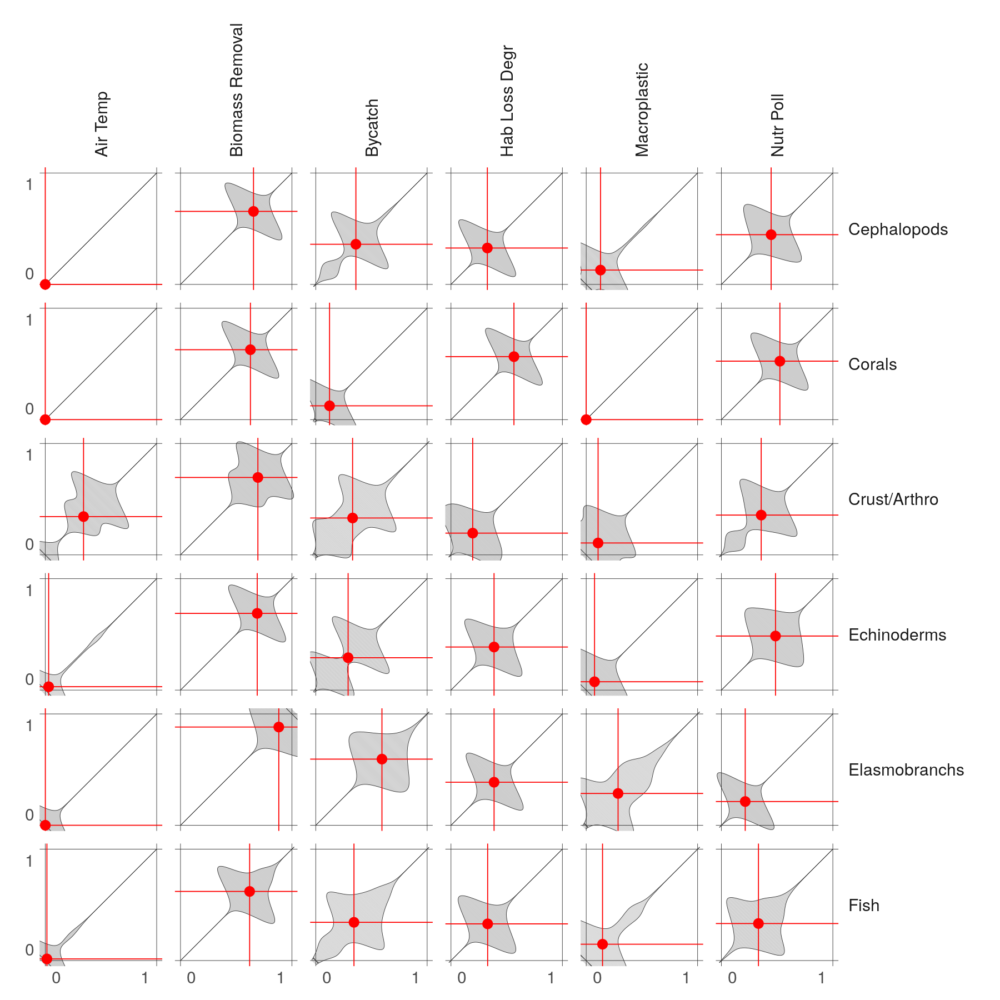
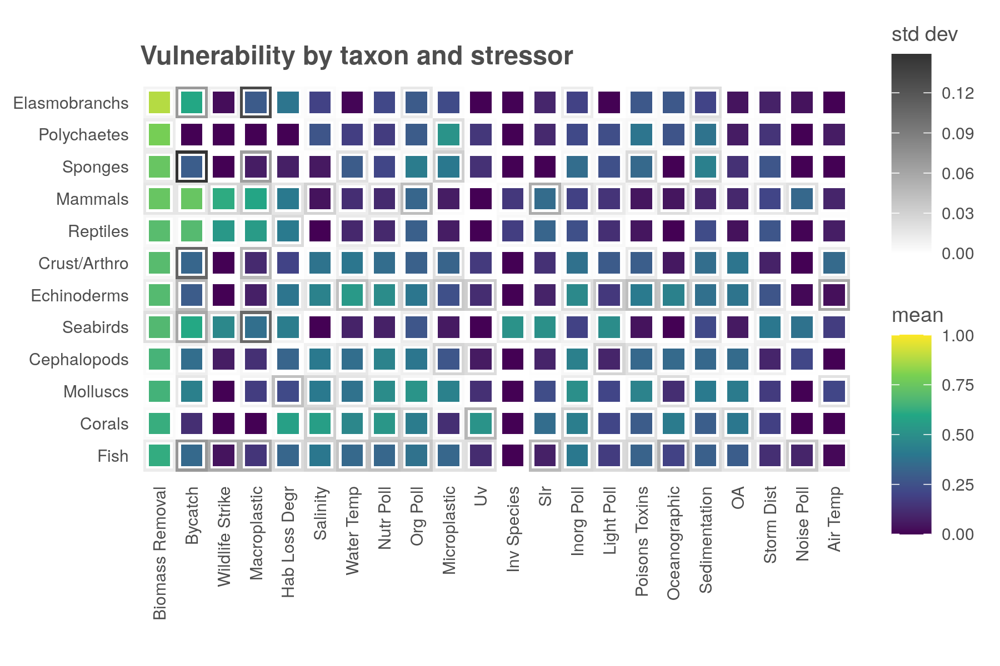

``` {r setup, echo = TRUE, message = FALSE, warning = FALSE}

knitr::opts_chunk$set(fig.width = 6, fig.height = 4, fig.path = 'figs/',
                      echo = TRUE, message = FALSE, warning = FALSE)

library(oharac) ### remotes::install_github('oharac/oharac')
oharac::setup()
source(here('common_fxns.R'))
options(dplyr.summarise.inform = FALSE) 

```

```{r}
clean_titles <- function(df) {
  x <- tibble::tribble(
                                 ~raw,            ~clean,
                        "cephalopods",     "Cephalopods",
                             "corals",          "Corals",
               "crustacea_arthropods",    "Crust/Arthro",
                        "echinoderms",     "Echinoderms",
                      "elasmobranchs",   "Elasmobranchs",
                               "fish",            "Fish",
                     "marine_mammals",         "Mammals",
                           "molluscs",        "Molluscs",
                        "polychaetes",     "Polychaetes",
                           "reptiles",        "Reptiles",
                           "seabirds",        "Seabirds",
                            "sponges",         "Sponges",
                           "air_temp",        "Air Temp",
                    "biomass_removal", "Biomass Removal",
                            "bycatch",         "Bycatch",
          "entanglement_macroplastic",    "Macroplastic",
  "eutrophication_nutrient_pollution",       "Nutr Poll",
           "habitat_loss_degradation",   "Hab Loss Degr",
                "inorganic_pollution",      "Inorg Poll",
                   "invasive_species",     "Inv Species",
                    "light_pollution",      "Light Poll",
                    "noise_pollution",      "Noise Poll",
                                 "oa",              "OA",
                      "oceanographic",   "Oceanographic",
                  "organic_pollution",        "Org Poll",
     "plastic_pollution_microplastic",    "Microplastic",
                     "poisons_toxins",  "Poisons Toxins",
                           "salinity",        "Salinity",
                      "sedimentation",   "Sedimentation",
                                "slr",             "Slr",
                  "storm_disturbance",      "Storm Dist",
                                 "uv",              "Uv",
                         "water_temp",      "Water Temp",
                    "wildlife_strike", "Wildlife Strike"
  )
  df <- df %>%
    left_join(x %>% rename(tx_clean = clean), by = c('taxon' = 'raw')) %>%
    left_join(x %>% rename(str_clean = clean), by = c('stressor' = 'raw'))
  return(df)
}
```

``` {r}
vuln_tx_df <- read_csv(here('_output', 'vuln_gapfilled_tx.csv'))
vuln_score_df <- read_csv(here('_output', 'vuln_gapfilled_score.csv')) %>%
  gather(stressor, vuln, -vuln_gf_id)
vuln_sd_df <- read_csv(here('_output', 'vuln_gapfilled_sd.csv')) %>%
  gather(stressor, vuln_sd, -vuln_gf_id)


vuln_df <- vuln_tx_df %>%
  full_join(vuln_score_df, by = 'vuln_gf_id') %>%
  full_join(vuln_sd_df, by = c('vuln_gf_id', 'stressor')) %>%
  clean_titles()
```

```{r hline vline}
taxa <- vuln_df$taxon %>% unique() %>% sort()
strs <- vuln_df$stressor %>% unique() %>% sort()

test_df <- vuln_df %>%
  filter(taxon %in% taxa[1:6]) %>%
  filter(stressor %in% strs[1:6]) %>%
  rowwise() %>%
  mutate(vuln_d = rnorm(n = 1, mean = vuln, sd = vuln_sd)) %>%
  group_by(stressor, taxon) %>%
  mutate(n_inv = 1/n()) %>%
  ungroup() %>%
  mutate(n_inv = n_inv / max(n_inv))

mean_df <- test_df %>%
  group_by(tx_clean, str_clean) %>%
  summarize(mean = mean(vuln, na.rm = TRUE))

linecol <- 'grey20'; linesize = .2
x <- ggplot(test_df) +
  theme_ohara() +
  geom_vline(aes(xintercept = vuln_d, alpha = n_inv), 
             color = linecol, size = linesize) +
  geom_hline(aes(yintercept = vuln_d, alpha = n_inv), 
             color = linecol, size = linesize) +
  geom_vline(data = mean_df, aes(xintercept = mean), color = 'yellow', size = .3) +
  geom_hline(data = mean_df, aes(yintercept = mean), color = 'yellow', size = .3) +
  geom_vline(data = mean_df, aes(xintercept = mean), color = 'red', size = .2) +
  geom_hline(data = mean_df, aes(yintercept = mean), color = 'red', size = .2) +
  geom_point(data = mean_df, aes(x = mean, y = mean), color = 'red') +
  coord_fixed(xlim = c(0, 1), ylim = c(0, 1), expand = FALSE) +
  scale_x_continuous(breaks = c(0.1, 0.9), labels = c(0, 1)) +
  scale_y_continuous(breaks = c(0.1, 0.9), labels = c(0, 1)) +
  scale_alpha(range = c(0.02, 0.06)) +
  facet_grid(tx_clean ~ str_clean) +
  theme(axis.title = element_blank(),
        legend.position = 'none',
        panel.grid.major = element_blank(),
        strip.background = element_blank(),
        strip.text.x = element_text(angle = 90, hjust = 0),
        strip.text.y = element_text(angle = 0, hjust = 0))
  
ggsave('vuln_summary_plot.png', width = 6, height = 6, dpi = 300)

```

```{r diag violin}
taxa <- vuln_df$taxon %>% unique() %>% sort()
strs <- vuln_df$stressor %>% unique() %>% sort()

test_df <- vuln_df %>%
  filter(taxon %in% taxa[1:6]) %>%
  filter(stressor %in% strs[1:6]) %>%
  rowwise() %>%
  mutate(vuln_d = rnorm(n = 1, mean = vuln, sd = vuln_sd)) %>%
  ungroup()

zeros <- test_df %>%
  group_by(tx_clean, str_clean) %>%
  summarize(all_zero = all(vuln == 0), .groups = 'drop')
  

mean_df <- test_df %>%
  group_by(tx_clean, str_clean) %>%
  summarize(mean = mean(vuln, na.rm = TRUE), .groups = 'drop')

dens_df <- test_df %>%
  group_by(tx_clean, str_clean) %>%
  summarize(x = list(KernSmooth::bkde(x = vuln_d, 
                                      kernel = 'normal', 
                                      bandwidth = .05) %>%
                       as.data.frame())) %>%
  unnest(x) %>%
  ### constrain x from 0 to 1
  filter(between(x, -.02, 1.02)) %>%
  ### rescale y from 0 to 1 for each plot; change grouping to allow for relative scales
  group_by(tx_clean, str_clean) %>%
  complete(x = c(0, 1), fill = list(y = 0)) %>%
  mutate(y = (y - min(y))/ (max(y) - min(y))) %>%
  ungroup() %>%
  rename(x_raw = x, y_raw = y) %>%
  left_join(zeros) %>%
  mutate(y_raw = ifelse(all_zero, 0, y_raw)) %>%
  arrange(x_raw)

y_scale <- .25
dens_diag <- dens_df %>%
  mutate(x1 = x_raw - y_scale * y_raw, x2 = x_raw + y_scale * y_raw,
         y1 = x_raw + y_scale * y_raw, y2 = x_raw - y_scale * y_raw) 

p <- ggplot(dens_diag) +
  theme_ohara() +
  geom_segment(aes(x = x1, y = y1, xend = x2, yend = y2), 
               color = 'grey80', alpha = 1, size = .1) +
  geom_path(aes(x = x1, y = y1), color = 'grey20', alpha = 1, size = .1) +
  geom_path(aes(x = x2, y = y2), color = 'grey20', alpha = 1, size = .1) +
  geom_vline(xintercept = c(0, 1), color = 'grey20', size = .1) +
  geom_hline(yintercept = c(0, 1), color = 'grey20', size = .1) +
  facet_grid(tx_clean ~ str_clean) +
  coord_fixed(xlim = c(0, 1), ylim = c(0, 1), expand = c(.02, 0)) +
  geom_vline(data = mean_df, aes(xintercept = mean), color = 'red', size = .2) +
  geom_hline(data = mean_df, aes(yintercept = mean), color = 'red', size = .2) +
  geom_point(data = mean_df, aes(x = mean, y = mean), color = 'red') +
  ### add labels but inset just a bit
  scale_x_continuous(breaks = c(0.1, 0.9), labels = c(0, 1)) +
  scale_y_continuous(breaks = c(0.1, 0.9), labels = c(0, 1)) +
  theme(axis.title = element_blank(),
        legend.position = 'none',
        panel.grid.major = element_blank(),
        axis.ticks.length = unit(0, 'cm'),
        strip.background = element_blank(),
        strip.text.x = element_text(angle = 90, hjust = 0),
        strip.text.y = element_text(angle = 0, hjust = 0))
  
ggsave('vuln_summary_plot_violin.png', width = 6, height = 6, dpi = 300)

```


```{r heatmap}
taxa <- vuln_df$taxon %>% unique() %>% sort()
strs <- vuln_df$stressor %>% unique() %>% sort()

mean_df <- vuln_df %>%
  group_by(tx_clean, str_clean) %>%
  summarize(v_mean = mean(vuln, na.rm = TRUE),
            v_sd = sqrt(mean(vuln_sd^2)),
            n_spp = n_distinct(species),
            .groups = 'drop') %>%
  arrange(desc(v_mean)) %>%
  mutate(tx_clean = fct_inorder(tx_clean) %>% fct_rev(),
         str_clean = fct_inorder(str_clean))


x <- ggplot(mean_df, aes(x = str_clean, y = tx_clean)) +
  theme_ohara() +
  geom_tile(aes(fill = v_sd)) +
  geom_point(color = 'white', shape = 15, size = 5) +
  geom_point(aes(color = v_mean), shape = 15, size = 4) +
  # geom_
  scale_color_viridis_c(limits = c(0, 1)) +
  scale_fill_gradient(low = 'white', high = 'grey20', 
                       breaks = seq(0, .15, .03)) +
  # scale_x_discrete(expand = c(0, 1.1)) +
  coord_fixed() +
  theme(axis.title = element_blank(),
        # legend.position = 'none',
        panel.grid.major = element_blank(),
        axis.text.x = element_text(angle = 90, hjust = 1, vjust = .5)) +
  labs(fill = 'std dev', color = 'mean',
       title = 'Vulnerability by taxon and stressor')
  
ggsave('vuln_heatmap.png', width = 6, height = 4, dpi = 300)

```
