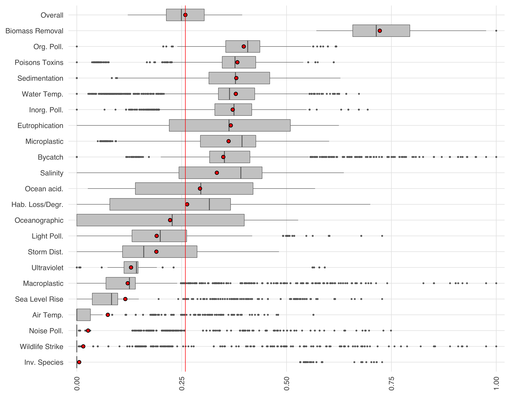
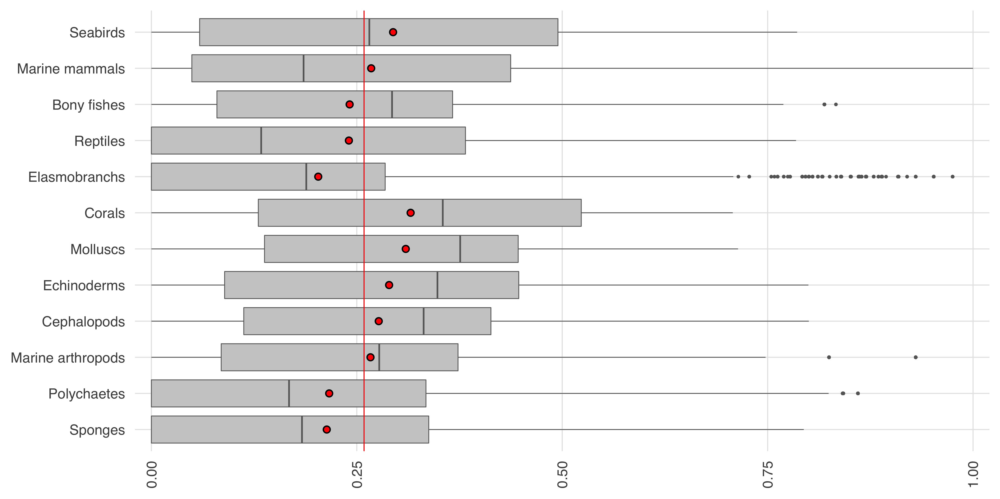
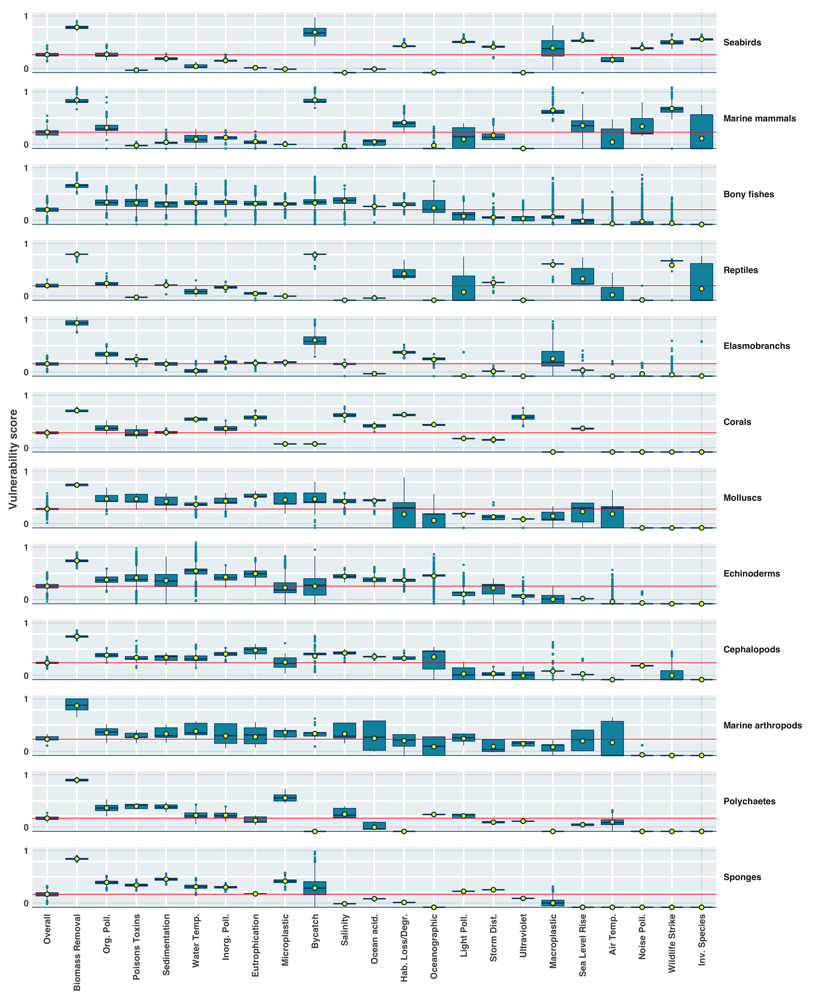

``` {r setup, echo = TRUE, message = FALSE, warning = FALSE}

knitr::opts_chunk$set(fig.width = 6, fig.height = 4, fig.path = 'figs/',
                      echo = TRUE, message = FALSE, warning = FALSE)

library(oharac) ### remotes::install_github('oharac/oharac')
oharac::setup()
source(here('common_fxns.R'))
options(dplyr.summarise.inform = FALSE) 

```

```{r}
clean_titles <- function(df) {
  x <- tibble::tribble(
                                 ~raw,            ~clean,
                        "cephalopods",     "Cephalopods",
                             "corals",          "Corals",
               "crustacea_arthropods",      "Marine arthropods",
                        "echinoderms",     "Echinoderms",
                      "elasmobranchs",   "Elasmobranchs",
                               "fish",            "Fish",
                     "marine_mammals",  "Marine mammals",
                           "molluscs",        "Molluscs",
                        "polychaetes",     "Polychaetes",
                           "reptiles",        "Reptiles",
                           "seabirds",        "Seabirds",
                            "sponges",         "Sponges",
                           "air_temp",        "Air Temp.",
                    "biomass_removal", "Biomass Removal",
                            "bycatch",         "Bycatch",
          "entanglement_macroplastic",    "Macroplastic",
  "eutrophication_nutrient_pollution",     "Eutrophication",
           "habitat_loss_degradation", "Hab. Loss/Degr.",
                "inorganic_pollution",    "Inorg. Poll.",
                   "invasive_species",    "Inv. Species",
                    "light_pollution",      "Light Poll.",
                    "noise_pollution",      "Noise Poll.",
                                 "oa",     "Ocean acid.",
                      "oceanographic",   "Oceanographic",
                  "organic_pollution",      "Org. Poll.",
     "plastic_pollution_microplastic",    "Microplastic",
                     "poisons_toxins",  "Poisons Toxins",
                           "salinity",        "Salinity",
                      "sedimentation",   "Sedimentation",
                                "slr",  "Sea Level Rise",
                  "storm_disturbance",     "Storm Dist.",
                                 "uv",     "Ultraviolet",
                         "water_temp",      "Water Temp.",
                    "wildlife_strike", "Wildlife Strike"
  )
  
  verts <- c("elasmobranchs", "fish", "marine_mammals", "reptiles", "seabirds")
  df <- df %>%
    mutate(vert = taxon %in% verts) %>%
    left_join(x %>% rename(tx_clean = clean), by = c('taxon' = 'raw')) %>%
    left_join(x %>% rename(str_clean = clean), by = c('stressor' = 'raw'))
  return(df)
}
```

``` {r}
vuln_tx_df <- read_csv(here('_output', 'vuln_gapfilled_tx.csv'))
vuln_score_df <- read_csv(here('_output', 'vuln_gapfilled_score.csv')) %>%
  gather(stressor, vuln, -vuln_gf_id)
vuln_sd_df <- read_csv(here('_output', 'vuln_gapfilled_sd.csv')) %>%
  gather(stressor, vuln_sd, -vuln_gf_id)


vuln_df <- vuln_tx_df %>%
  full_join(vuln_score_df, by = 'vuln_gf_id') %>%
  full_join(vuln_sd_df, by = c('vuln_gf_id', 'stressor')) %>%
  clean_titles()
```

```{r hline vline, eval = FALSE}
taxa <- vuln_df$taxon %>% unique() %>% sort()
strs <- vuln_df$stressor %>% unique() %>% sort()

test_df <- vuln_df %>%
  filter(taxon %in% taxa[1:6]) %>%
  filter(stressor %in% strs[1:6]) %>%
  rowwise() %>%
  mutate(vuln_d = rnorm(n = 1, mean = vuln, sd = vuln_sd)) %>%
  group_by(stressor, taxon) %>%
  mutate(n_inv = 1/n()) %>%
  ungroup() %>%
  mutate(n_inv = n_inv / max(n_inv))

mean_df <- test_df %>%
  group_by(tx_clean, str_clean) %>%
  summarize(mean = mean(vuln, na.rm = TRUE))

linecol <- 'grey20'; linesize = .2
x <- ggplot(test_df) +
  theme_ohara() +
  geom_vline(aes(xintercept = vuln_d, alpha = n_inv), 
             color = linecol, size = linesize) +
  geom_hline(aes(yintercept = vuln_d, alpha = n_inv), 
             color = linecol, size = linesize) +
  geom_vline(data = mean_df, aes(xintercept = mean), color = 'yellow', size = .3) +
  geom_hline(data = mean_df, aes(yintercept = mean), color = 'yellow', size = .3) +
  geom_vline(data = mean_df, aes(xintercept = mean), color = 'red', size = .2) +
  geom_hline(data = mean_df, aes(yintercept = mean), color = 'red', size = .2) +
  geom_point(data = mean_df, aes(x = mean, y = mean), color = 'red') +
  coord_fixed(xlim = c(0, 1), ylim = c(0, 1), expand = TRUE) +
  scale_x_continuous(breaks = c(0.1, 0.9), labels = c(0, 1)) +
  scale_y_continuous(breaks = c(0.1, 0.9), labels = c(0, 1)) +
  scale_alpha(range = c(0.02, 0.06)) +
  facet_grid(tx_clean ~ str_clean) +
  theme(axis.title = element_blank(),
        legend.position = 'none',
        panel.grid.major = element_blank(),
        strip.background = element_blank(),
        strip.text.x = element_text(angle = 90, hjust = 0),
        strip.text.y = element_text(angle = 0, hjust = 0))
  
ggsave('ms_figs/vuln_summary_plot.png', width = 6, height = 6, dpi = 300)

```

```{r diag violin, eval = FALSE}
taxa <- vuln_df$taxon %>% unique() %>% sort()
strs <- vuln_df$stressor %>% unique() %>% sort()

test_df <- vuln_df %>%
  filter(taxon %in% taxa[1:6]) %>%
  filter(stressor %in% strs[1:6]) %>%
  rowwise() %>%
  mutate(vuln_d = rnorm(n = 1, mean = vuln, sd = vuln_sd)) %>%
  ungroup()

zeros <- test_df %>%
  group_by(tx_clean, str_clean) %>%
  summarize(all_zero = all(vuln == 0), .groups = 'drop')
  

mean_df <- test_df %>%
  group_by(tx_clean, str_clean) %>%
  summarize(mean = mean(vuln, na.rm = TRUE), .groups = 'drop')

dens_df <- test_df %>%
  group_by(tx_clean, str_clean) %>%
  summarize(x = list(KernSmooth::bkde(x = vuln_d, 
                                      kernel = 'normal', 
                                      bandwidth = .05) %>%
                       as.data.frame())) %>%
  unnest(x) %>%
  ### constrain x from 0 to 1
  filter(between(x, -.02, 1.02)) %>%
  ### rescale y from 0 to 1 for each plot; change grouping to allow for relative scales
  group_by(tx_clean, str_clean) %>%
  complete(x = c(0, 1), fill = list(y = 0)) %>%
  mutate(y = (y - min(y))/ (max(y) - min(y))) %>%
  ungroup() %>%
  rename(x_raw = x, y_raw = y) %>%
  left_join(zeros) %>%
  mutate(y_raw = ifelse(all_zero, 0, y_raw)) %>%
  arrange(x_raw)

y_scale <- .25
dens_diag <- dens_df %>%
  mutate(x1 = x_raw - y_scale * y_raw, x2 = x_raw + y_scale * y_raw,
         y1 = x_raw + y_scale * y_raw, y2 = x_raw - y_scale * y_raw) 

p <- ggplot(dens_diag) +
  theme_ohara() +
  geom_segment(aes(x = x1, y = y1, xend = x2, yend = y2), 
               color = 'grey80', alpha = 1, size = .1) +
  geom_path(aes(x = x1, y = y1), color = 'grey20', alpha = 1, size = .1) +
  geom_path(aes(x = x2, y = y2), color = 'grey20', alpha = 1, size = .1) +
  geom_vline(xintercept = c(0, 1), color = 'grey20', size = .1) +
  geom_hline(yintercept = c(0, 1), color = 'grey20', size = .1) +
  facet_grid(tx_clean ~ str_clean) +
  coord_fixed(xlim = c(0, 1), ylim = c(0, 1), expand = c(.02, 0)) +
  geom_vline(data = mean_df, aes(xintercept = mean), color = 'red', size = .2) +
  geom_hline(data = mean_df, aes(yintercept = mean), color = 'red', size = .2) +
  geom_point(data = mean_df, aes(x = mean, y = mean), color = 'red') +
  ### add labels but inset just a bit
  scale_x_continuous(breaks = c(0.1, 0.9), labels = c(0, 1)) +
  scale_y_continuous(breaks = c(0.1, 0.9), labels = c(0, 1)) +
  theme(axis.title = element_blank(),
        legend.position = 'none',
        panel.grid.major = element_blank(),
        axis.ticks.length = unit(0, 'cm'),
        strip.background = element_blank(),
        strip.text.x = element_text(angle = 90, hjust = 0),
        strip.text.y = element_text(angle = 0, hjust = 0))
  
ggsave('ms_figs/vuln_summary_plot_violin.png', width = 6, height = 6, dpi = 300)

```


```{r heatmap, eval = FALSE}
taxa <- vuln_df$taxon %>% unique() %>% sort()
strs <- vuln_df$stressor %>% unique() %>% sort()

mean_df <- vuln_df %>%
  group_by(tx_clean, str_clean) %>%
  summarize(v_mean = mean(vuln, na.rm = TRUE),
            v_sd = sqrt(mean(vuln_sd^2)),
            n_spp = n_distinct(species),
            .groups = 'drop') %>%
  arrange(desc(v_mean)) %>%
  mutate(tx_clean = fct_inorder(tx_clean) %>% fct_rev(),
         str_clean = fct_inorder(str_clean))


x <- ggplot(mean_df, aes(x = str_clean, y = tx_clean)) +
  theme_ohara() +
  geom_tile(aes(fill = v_sd)) +
  geom_point(color = 'white', shape = 15, size = 5) +
  geom_point(aes(color = v_mean), shape = 15, size = 4) +
  # geom_
  scale_color_viridis_c(limits = c(0, 1)) +
  scale_fill_gradient(low = 'white', high = 'grey20', 
                       breaks = seq(0, .15, .03)) +
  # scale_x_discrete(expand = c(0, 1.1)) +
  coord_fixed() +
  theme(axis.title = element_blank(),
        # legend.position = 'none',
        panel.grid.major = element_blank(),
        axis.text.x = element_text(angle = 90, hjust = 1, vjust = .5)) +
  labs(fill = 'std dev', color = 'mean',
       title = 'Vulnerability by taxon and stressor')
  
ggsave('ms_figs/vuln_heatmap.png', width = 6, height = 4, dpi = 300)

```

```{r str_summary_boxplot}
vuln_overall_df <- vuln_df %>%
  group_by(species, tx_clean, vert) %>%
  summarize(vuln = mean(vuln, na.rm = TRUE),
            vuln_sd = sqrt(mean(vuln_sd^2)),
            .groups = 'drop') %>%
  mutate(str_clean = 'Overall')

str_cats <- readxl::read_excel(here('_raw_data/si_tables.xlsx'), sheet = 3)
str_summary_df <- vuln_df %>%
  mutate(v_mean_all = mean(vuln, na.rm = TRUE)) %>%
  bind_rows(vuln_overall_df) %>%
  group_by(str_clean) %>%
  summarize(v_mean_all = first(v_mean_all),
            v_mean = mean(vuln, na.rm = TRUE),
            v_sd = sqrt(mean(vuln_sd^2)),
            n_spp = n_distinct(species),
            .groups = 'drop') %>%
  arrange(v_mean) %>%
  mutate(str_clean = fct_inorder(str_clean) %>% 
                       fct_relevel('Overall', after = Inf))


x <- ggplot(vuln_df %>%
              bind_rows(vuln_overall_df) %>%
              mutate(str_clean = factor(str_clean, levels = levels(str_summary_df$str_clean))), 
            aes(x = str_clean, y = vuln)) +
  theme_ohara() +
  geom_boxplot(color = 'grey40', size = .2, fill = 'grey80', outlier.size = .2) +
  geom_point(data = str_summary_df, aes(y = v_mean), 
             shape = 21, color = 'black', fill = 'red', size = 1.3) +
  geom_hline(data = str_summary_df, 
             aes(yintercept = v_mean_all), color = 'red', size = .25) +
  scale_y_continuous(expand = c(.01, .01)) +
  coord_flip() +
  theme(axis.title = element_blank(),
        axis.text.x = element_text(angle = 90, hjust = 1, vjust = .5)) # +
  # labs(title = 'Vulnerability distribution by stressor')
  
ggsave('ms_figs/vuln_dist_str_box.png', width = 4, height = 3, dpi = 300)

```

```{r taxa_summary_boxplot}

tx_summary_df <- vuln_df %>%
  mutate(v_mean_all = mean(vuln, na.rm = TRUE)) %>%
  group_by(tx_clean, vert) %>%
  summarize(v_mean_all = first(v_mean_all),
            v_mean = mean(vuln, na.rm = TRUE),
            v_sd = sqrt(mean(vuln_sd^2)),
            n_spp = n_distinct(species),
            .groups = 'drop') %>%
  arrange(vert, v_mean) %>%
  mutate(tx_clean = fct_inorder(tx_clean))


x <- ggplot(vuln_df %>%
              mutate(tx_clean = factor(tx_clean, levels = levels(tx_summary_df$tx_clean))), 
            aes(x = tx_clean, y = vuln)) +
  theme_ohara() +
  geom_boxplot(color = 'grey40', size = .2, fill = 'grey80', outlier.size = .2) +
  geom_point(data = tx_summary_df, aes(y = v_mean), 
             shape = 21, color = 'black', fill = 'red', size = 1.3) +
  geom_hline(data = tx_summary_df, 
             aes(yintercept = v_mean_all), color = 'red', size = .25) +
  scale_y_continuous(expand = c(.01, .01)) +
  coord_flip() +
  theme(axis.title = element_blank(),
        axis.text.x = element_text(angle = 90, hjust = 1, vjust = .5)) #+
  # labs(title = 'Vulnerability distribution by taxon')
  
ggsave('ms_figs/vuln_dist_tx_box.png', width = 4, height = 2, dpi = 300)

```

```{r setup for taxa_12x1panel_boxplot}

vuln_overall_df <- vuln_df %>%
  group_by(species, tx_clean, vert) %>%
  summarize(vuln = mean(vuln, na.rm = TRUE),
            vuln_sd = sqrt(mean(vuln_sd^2)),
            .groups = 'drop') %>%
  mutate(str_clean = 'Overall')

tx_summary_df <- vuln_df %>%
  bind_rows(vuln_overall_df) %>%
  group_by(tx_clean) %>%
  mutate(v_mean_all = mean(vuln, na.rm = TRUE)) %>%
  group_by(tx_clean, str_clean, vert) %>%
  summarize(v_mean_all = first(v_mean_all),
            v_mean = mean(vuln, na.rm = TRUE),
            v_sd = sqrt(mean(vuln_sd^2)),
            n_spp = n_distinct(species),
            .groups = 'drop') %>%
  mutate(overall = str_clean == 'Overall') %>%
  arrange(!overall, !vert, desc(v_mean)) %>%
  mutate(tx_clean = fct_inorder(tx_clean),
         str_clean = fct_inorder(str_clean) %>% 
                       fct_relevel('Overall') %>%
                       fct_rev())

plot_df <- vuln_df %>%
  bind_rows(vuln_overall_df) %>%
  mutate(tx_clean = factor(tx_clean, levels = levels(tx_summary_df$tx_clean)),
         str_clean = factor(str_clean, levels = levels(str_summary_df$str_clean))) %>%
  rowwise() %>%
  mutate(v = rnorm(n = 1, mean = vuln, sd = vuln_sd),
         v = case_when(v < 0 ~ 0, v > 1 ~ 1, TRUE ~ v)) %>%
  ungroup()

```

``` {r taxa_12x1panel_boxplot}
### Theme cols from Nat to match other figs (from light to dark)
theme_cols <- c('#0294AD', '#006989', '#00446C')

x <- ggplot(plot_df %>% mutate(str_clean = fct_rev(str_clean)), 
            aes(x = str_clean, y = v)) +
  theme_ohara(base_size = 7) +
  ### manually create panel background and gridlines
  scale_x_discrete(expand = c(0, 0)) +
  annotate('rect', xmin = .5, xmax = 23.5, ymin = 0, ymax = 1, 
           color = NA, fill = theme_cols[2], alpha = .1) +
  geom_hline(yintercept = c(.25, .5, .75, 1), color = 'white', size = .5) +
  geom_vline(xintercept = 1:22, color = 'white', size = .5) +
  geom_hline(yintercept = 0, color = theme_cols[3], size = .2) +
  scale_y_continuous(breaks = c(0.07, 0.93), labels = c('0', '1')) +
  ### boxplot
  geom_boxplot(color = theme_cols[3], size = .2, fill = theme_cols[1], 
               outlier.size = .05, 
               outlier.color = theme_cols[1]) +
  # geom_jitter(color = 'black', size = .1, alpha = .1) +
  geom_hline(data = tx_summary_df, 
             aes(yintercept = v_mean_all), color = 'red', size = .2) +
  geom_point(data = tx_summary_df, aes(y = v_mean), 
             shape = 21, color = theme_cols[3], fill = 'yellow', size = 1) +
  theme(strip.background = element_blank(),
        strip.text.y = element_text(face = 'bold', hjust = 0, angle = 0),
        axis.title.x = element_blank(),
        axis.ticks.length = unit(0, 'cm'),
        axis.text.x = element_text(angle = 90, hjust = 1, vjust = .5, face = 'bold'),
        axis.text.y = element_text(angle =  0, hjust = 1, vjust = .5, face = 'bold'),
        axis.title.y = element_text(face = 'bold')) +
  labs(# title = 'Vulnerability distribution by taxon and stressor',
       y = 'Vulnerability score') +
  facet_wrap( ~ tx_clean, ncol = 1, strip.position = 'right')
  
ggsave('ms_figs/vuln_dist_tx_12x1panel.png', width = 5, height = 8, dpi = 300)

```

### Save summary as table for supplement
```{r}
si_table <- tx_summary_df %>%
  select(tx_clean, str_clean, v_mean, n_spp) %>%
  spread(str_clean, v_mean) %>%
  select(Taxon = tx_clean, everything(), Overall, `N spp` = n_spp)

write_csv(si_table, here('_output/vuln_summary_table.csv'))
knitr::kable(si_table)
```

